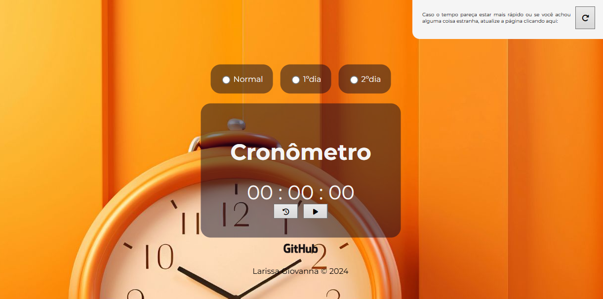

# ⏱️ Cronômetro ENEM

<div align="center">
  
  
  
  
  
  <p>Uma ferramenta web de cronometragem desenvolvida especialmente para estudantes que se preparam para o ENEM e vestibulares.</p>
  
  [🚀 Acessar](https://larissagiovanna.github.io/cronometro-enem/) | [📝 Sobre](#-sobre) | [✨ Funcionalidades](#-funcionalidades) | [🛠️ Tecnologias](#️-tecnologias)

</div>

---

## 📝 Sobre

O **Cronômetro ENEM** é uma aplicação web criada para ajudar estudantes a gerenciar melhor seu tempo durante simulados e preparação para provas.  Com modos específicos para os dias 1 e 2 do ENEM, permite treinar com os tempos reais da prova.

## ✨ Funcionalidades

- ⏱️ **Cronômetro preciso** com contador progressivo
- 📅 **Modo Normal**:  Cronômetro padrão sem limite de tempo
- 📝 **Modo 1º Dia**: Configurado para o tempo do primeiro dia do ENEM (Linguagens e Ciências Humanas)
- 🧮 **Modo 2º Dia**: Configurado para o tempo do segundo dia do ENEM (Matemática e Ciências da Natureza)
- ▶️ **Controles intuitivos**: Play, Pause, Resume e Reset
- 🔄 **Botão de atualização rápida** em caso de problemas
- 📱 **Design responsivo** para uso em diferentes dispositivos
- 🎨 **Interface moderna e limpa**

## 🖥️ Captura de Tela



## 🛠️ Tecnologias

Este projeto foi desenvolvido com as seguintes tecnologias:

- **HTML5** - Estrutura da aplicação
- **CSS3** - Estilização e layout responsivo
- **JavaScript** - Lógica do cronômetro e interatividade
- **Font Awesome** - Ícones da interface

## 📁 Estrutura do Projeto

```
cronometro-enem/
│
├── index.html          # Página principal
├── css/
│   └── style.css      # Estilos da aplicação
├── js/
│   └── script.js      # Lógica do cronômetro
└── img/               # Imagens e ícones
```

## 🚀 Como Usar

1. **Clone o repositório**
   ```bash
   git clone https://github.com/LarissaGiovanna/cronometro-enem.git
   ```

2. **Acesse o diretório**
   ```bash
   cd cronometro-enem
   ```

3. **Abra o arquivo**
   - Abra o arquivo `index.html` diretamente no seu navegador
   - Ou use um servidor local como Live Server (extensão do VS Code)

## 💡 Como Funciona

1. **Selecione o modo desejado:**
   - **Normal**: Cronômetro livre para estudos gerais
   - **1º Dia**: Simulação do tempo do primeiro dia do ENEM
   - **2º Dia**:  Simulação do tempo do segundo dia do ENEM

2. **Use os controles:**
   - ▶️ **Play**: Inicia o cronômetro
   - ⏸️ **Pause**:  Pausa o cronômetro
   - ▶️ **Resume**: Retoma a contagem
   - 🔄 **Reset**:  Reinicia o cronômetro

3. **Acompanhe o tempo** enquanto resolve questões e simulados

## 🎯 Casos de Uso

- ✅ Treinar para o ENEM com tempo real de prova
- ✅ Realizar simulados cronometrados
- ✅ Praticar gestão de tempo durante estudos
- ✅ Simular condições de prova
- ✅ Medir tempo gasto em diferentes disciplinas

## 🤝 Contribuindo

Contribuições são sempre bem-vindas! Se você tem alguma sugestão para melhorar este projeto: 

1. Faça um Fork do projeto
2. Crie uma Branch para sua feature (`git checkout -b feature/NovaFuncionalidade`)
3. Commit suas mudanças (`git commit -m 'Adiciona nova funcionalidade'`)
4. Push para a Branch (`git push origin feature/NovaFuncionalidade`)
5. Abra um Pull Request

## 📄 Licença

Este projeto está sob a licença MIT. Veja o arquivo [LICENSE](LICENSE) para mais detalhes.

## 👥 Créditos

- **Design/Front-end**: [sthef12](https://github.com/sthef12)
- **Desenvolvimento/Back-end**: [LarissaGiovanna](https://github.com/LarissaGiovanna)

---

<div align="center">
  <p>⭐ Se este projeto te ajudou, considere dar uma estrela! </p>
</div>